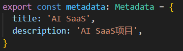
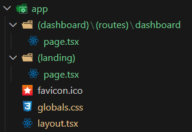

# 02 文件夹设置

## 设置globals.css

插入

```css
html,
body,
:root{
height:100%;
} 
```

  

??? note "为什么?"

    在CSS中，`html`, `body`, 和 `:root` 选择器通常用来选择HTML页面的最顶层元素。
    
    这里的代码：
    
    ```css
    html,
    body,
    :root {
      height: 100%;
    }
    ```
    
    意味着给HTML文档的 `<html>` 元素、`<body>` 元素以及`:root`伪类（在HTML中`:root`通常指的是`<html>`元素）设置了一个高度，让它们的高度都是100%。这里的100%是相对于它们各自的包含块 —— 通常是浏览器视窗的高度。这种设置可以确保页面的根元素和主体元素的高度至少和视窗一样高，这是创建全屏网页布局的一种常见做法。
    
    这样设置的目的通常是为了能够在页面中使用基于百分比的高度值，这样子元素就可以根据父元素的高度来设置自己的高度。如果不设置这些元素的高度，子元素的百分比高度将没有效果，因为默认情况下，`<html>` 和 `<body>` 的高度仅由它们包含的内容决定。通过设置这些元素的高度为100%，可以让它们的子元素使用百分比来定义自己的高度。

## 设置layout.tsx

页面标题

 

## 使用代码片段快速创建

在Visual Studio Code中，你以创建自定义的代码片段（snippets）。这样，你可以通过输入一个简短的缩写来生成一个预先定义的组件模板。

下面是如何在Visual Studio Code中创建代码片段的一个例子：

1. 在Visual Studio Code中，打开**用户代码片段**（通过按下 `F1` 或 `Ctrl+Shift+P` 然后搜索`Preferences: Configure User Snippets`）。

2. 选择`typescriptreact.json`（针对TSX文件）。

3. 定义你的代码片段。例如：

```json
{
	"React Functional Component": {
	  "prefix": "sfc",
	  "body": [
		"const $1 = () => {",
		"  return (",
		"    $0",
		"  );",
		"};",
		"",
		"export default $1;"
	  ],
	  "description": "React Stateless Functional Component"
	}
  }
  
```

4. 保存并关闭代码片段文件。

现在，每当你在`.tsx`文件中输入`sfc`并按下`Tab`键时，它都会生成一个函数式组件的模板，你可以替换`$1`为你的组件名，`$0`将是光标最终的位置。这将大大提高创建新组件的效率。

??? note "箭头函数和平面函数"

    箭头函数（Arrow functions）和传统的函数表达式（有时被称为“平面函数”或“普通函数”）在JavaScript中有几个关键的区别：
    
    **语法简洁**：
    
       - 箭头函数提供了更简洁的函数编写方式。例如：`const sum = (a, b) => a + b;` 相比于传统函数表达式：`const sum = function(a, b) { return a + b; };`。
    
    **`this`值的绑定**：
    
       - 箭头函数不会创建自己的`this`值，它的`this`值继承自创建它的上下文（即定义它的代码块）。这意味着在箭头函数内部使用`this`时，它指向的是定义时的上下文。
       
       - 传统函数有自己的`this`值，通常指向调用该函数的对象。如果在严格模式下或者函数独立调用时（不作为某个对象的方法），`this`会是`undefined`。
    
    **没有`arguments`对象**：
    
       - 箭头函数没有自己的`arguments`对象。尽管如此，仍然可以通过剩余参数（`...args`）来访问函数的参数列表。
       
       - 传统函数有自己的`arguments`对象，可以通过`arguments`变量访问传递给函数的所有参数。
    
    **不能作为构造函数**：
    
       - 箭头函数不能用作构造函数，因此不能使用`new`关键字。如果尝试这样做，JavaScript将会抛出错误。
       
       - 传统函数可以用作构造函数，可以和`new`一起使用来创建一个新的对象实例。
    
    **没有`prototype`属性**：
    
       - 箭头函数没有`prototype`属性，因为它们不能作为构造函数。
       
       - 传统函数有`prototype`属性，这意味着可以在它上面添加属性和方法，这些属性和方法可以被所有通过这个函数创建的对象实例继承。
    
    **适用场景**：
    
       - 箭头函数常用于回调函数和那些需要保持上下文`this`值的场合，如事件处理器或定时器。
       
       - 传统函数则更适合需要动态上下文，或者需要作为构造函数的场景。
    
    在使用上，选择哪一种函数取决于具体需求，尤其是对`this`值的绑定行为的需求。箭头函数由于语法简洁和`this`行为，常用于函数式编程和方法链中，而传统函数更多的是在需要一个具有自身`this`上下文的普通函数对象的场合。

## 设置路由组Route Groups

[Routing: Route Groups | Next.js (nextjs.org)](https://nextjs.org/docs/app/building-your-application/routing/route-groups)

需求：自己本地的代码文件目录结构保持分类的形式，有条理，但不需要把目录的名字作为路由。

给文件名加上`()`

示例：

创建的结构如下所示

  

> 目的：创建2个页面，一个登录页面(/)，一个登陆后的控制面板页面(/dashboard)
>
> 接着使用Clerk添加身份验证和用户管理功能（详见下一节）
