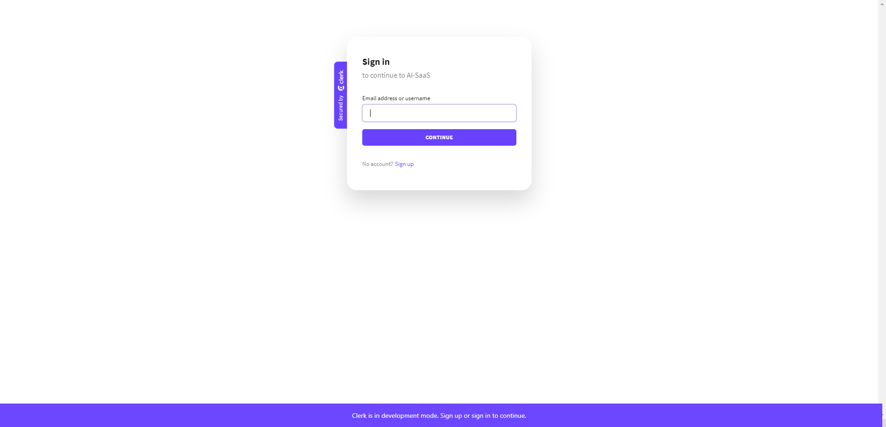

[Clerk | Authentication and User Management](https://clerk.com/)

## 创建项目

使用谷歌账号注册后登录

设置认证时需要的登录方式

 

创建项目后得到一个API Key

 

## 使用Clerk为Next.js应用程序添加身份验证和用户管理功能

### 安装@clerk/nextjs

[Add authentication and user management to your Next.js app with Clerk in 7 minutes | Clerk](https://clerk.com/docs/quickstarts/nextjs)

```shell
npm install @clerk/nextjs
```

### 设置环境密钥

把上面生成的密钥复制到nextjs项目下的`.env`（新建）文件中

??? note ".env是什么?"

    .env是一个文件，用于存储环境变量，例如API密钥，数据库连接字符串等。环境变量是一些可以在不同的环境中改变的值，例如开发环境，测试环境，生产环境等²。使用环境变量可以让你的代码更灵活，更安全，更易于维护。
    
    Next.js支持从.env.local文件中加载环境变量到process.env对象中，这样你就可以在Next.js的数据获取方法和API路由中使用它们。例如，你可以在.env.local文件中定义一个API密钥，然后在getStaticProps方法中使用它来调用一个外部的API。
    
    如果你想让你的环境变量在浏览器中也可用，你需要在变量名前加上NEXT_PUBLIC_的前缀。这样，Next.js会在构建时把这些变量内联到客户端的js包中，替换掉所有对process.env.[variable]的引用。例如，你可以在.env.local文件中定义一个NEXT_PUBLIC_ANALYTICS_ID变量，然后在你的代码中任何地方使用它。

??? note "`.env.local`也行"

    Next.js 项目中的 .env.local 和 .env 文件都是用来存储环境变量的，但是它们有一些区别：
    
    - `.env` 文件是用来设置所有环境（development, production, test）下的默认环境变量的，它应该被提交到源码仓库中。
    - `.env.local` 文件是用来覆盖 `.env` 文件中的默认环境变量的，它应该被添加到 `.gitignore` 中，因为它可能包含一些敏感信息，比如数据库密码。
    - `.env.local` 文件只在开发环境（next dev）和生产环境（next start）中生效，而不会在测试环境（next test）中生效。

??? note "开发、生产、测试环境"

    开发环境、生产环境和测试环境是指运行 Next.js 项目的不同模式，它们有不同的目的和特点：
    
    - 开发环境（next dev）是用来在本地开发和调试 Next.js 项目的，它支持热重载、快速刷新和错误提示等功能，可以帮助你快速开发和修改代码。例如，你可以在终端中输入 `next dev` 命令来启动开发环境，然后在浏览器中访问 `http://localhost:3000` 来查看你的项目。
    - 生产环境（next start）是用来部署和运行 Next.js 项目的，它会对项目进行优化和打包，提高性能和安全性，适合用于正式上线的网站。例如，你可以在终端中输入 `next build` 命令来构建你的项目，然后输入 `next start` 命令来启动生产环境，然后在浏览器中访问你的域名来访问你的网站。
    - 测试环境（next test）是用来对 Next.js 项目进行单元测试或集成测试的，它可以检查你的代码是否符合预期的功能和逻辑，避免出现错误和bug。例如，你可以使用 jest 或 cypress 等工具来编写和运行测试用例，然后在终端中输入 `next test` 命令来启动测试环境，然后查看测试结果和报告。

### 使用`＜ClerkProvider/＞`包装APP

```tsx title="/app/layout.tsx"
import type { Metadata } from "next";
import { Inter } from "next/font/google";
import "./globals.css";
import { ClerkProvider } from "@clerk/nextjs";

const inter = Inter({ subsets: ["latin"] });

export const metadata: Metadata = {
  title: "Ean",
  description: "AI平台",
};

export default function RootLayout({
  children,
}: {
  children: React.ReactNode;
}) {
  return (
    <ClerkProvider>
      <html lang="en">
        <body className={inter.className}>{children}</body>
      </html>
    </ClerkProvider>
  );
}
```

### 需要身份验证才能访问应用程序

Clerk已经安装在应用程序中，可以决定哪些页面是公共的，哪些页面需要身份验证才能访问。

新建一个在 `middleware.ts` ，根目录上和`.env`一起

```ts title="middleware.ts"
import { authMiddleware } from "@clerk/nextjs";
 
// This example protects all routes including api/trpc routes
// Please edit this to allow other routes to be public as needed.
// See https://clerk.com/docs/references/nextjs/auth-middleware for more information about configuring your Middleware
export default authMiddleware({});
 
export const config = {
  matcher: ['/((?!.+\\.[\\w]+$|_next).*)', '/', '/(api|trpc)(.*)'],
};
```

现在可以通过http://localhost:3000 来访问应用程序。

Middleware将重定向到注册页面



注册登陆后会跳转到首页

??? note "Middleware中间件"

    https://nextjs.org/docs/pages/building-your-application/routing/middleware
    
    middleware.ts 是 Next.js 项目中用来定义中间件的文件，中间件可以让你在请求完成之前运行一些代码，比如重写、重定向、修改请求或响应头，或者直接响²。中间件的文件名必须是 middleware.ts（或 .js），并且放在项目的根目录下，和 pages 或 app 同级。
    
    中间件的结构是一个柯里化的函数，它接收一个 store 参数，返回一个 next 参数，再返回一个 action 参数，最后返回一个响应对象。例如，下面的中间件会把所有请求重定向到 /home 路径：
    
    ```js
    import { NextResponse } from 'next/server'
    import type { NextRequest } from 'next/server'
    
    export function middleware(request: NextRequest) {
      return NextResponse.redirect(new URL('/home', request.url))
    }
    ```
    
    你还可以通过 config 对象来指定中间件匹配的路径，使用正则表达式或命名参数。例如，下面的中间件只会匹配 /about 路径下的请求：
    
    ```js
    export const config = {
      matcher: '/about/:path*',
    }
    ```

??? note "柯里化的函数"

    柯里化的函数是一种函数式编程的技巧，它可以把一个接收多个参数的函数转换成一系列接收单个参数的函数，从而实现部分应用、延迟计算和函数组合等功能 。例如，下面的函数 add 可以接收两个参数 x 和 y，返回它们的和：
    
    ```js
    function add(x, y) {
      return x + y
    }
    ```
    
    我们可以把它柯里化成一个接收单个参数 x 的函数，返回一个接收单个参数 y 的函数，再返回 x 和 y 的和：
    
    ```js
    function curriedAdd(x) {
      return function (y) {
        return x + y
      }
    }
    ```
    
    这样，我们就可以先传入一个参数 x，得到一个新的函数，然后再传入另一个参数 y，得到最终的结果。例如：
    
    ```js
    const addFive = curriedAdd(5) // 返回一个函数
    const result = addFive(10) // 返回 15
    ```
    
    柯里化的函数可以让我们更灵活地使用函数，比如创建一些预设的函数，或者把多个函数组合起来，形成更复杂的功能 。

### 嵌入 `<UserButton />`

Clerk提供了一套[预构建的组件](https://clerk.com/docs/components/overview)，可以最大限度地为应用程序添加功能。 [``<UserButton />``](https://clerk.com/docs/components/user/user-button) 允许用户管理其帐户信息和注销，完成完整的身份验证周期。

在应用程序的`<ClerkProvider/>`中任何地方都可以添加它。

`afterSignOutUrl`属性设置自定义用户注销后将重定向到的页面。

> 可以放在登录后的控制面板中

```tsx title="app/(dashboard)/(routes)/dashboard/page.tsx"
import { Button } from "@/components/ui/button";
import { UserButton } from "@clerk/nextjs";

const DashboardPage = () => {
  return (
    <div>
      <p>控制面板（受保护）</p>
      <UserButton afterSignOutUrl="/" />
    </div>
  );
};

export default DashboardPage;
```

### 注销应用程序

测试一下退出后回到的页面

## 使用Clerk为Next.js应用程序构建自己的登录和注册页面

Clerk提供了一套[预构建的组件](https://clerk.com/docs/components/overview)和[自定义流程](https://clerk.com/docs/custom-flows/overview)，可以将它们用于将登录、注册和其他用户管理功能嵌入到Next.js应用程序中。

### 建立注册页面

```tsx title="app/(auth)/(routes)/sign-up/[[...sign-up]]/page.tsx"
import { SignUp } from "@clerk/nextjs";
 
export default function Page() {
  return <SignUp />;
}
```

??? note "`[[...sign-up]]`"

    在 Next.js 中，`[[...]]` 用于文件名是用来表示动态路由的一种特殊语法。Next.js 的路由是基于页面文件系统的，当你在 `pages` 目录下创建文件时，这个文件的路径就对应于一个路由。
    
    这里的 `[[...sign-up]]` 表示一个“捕获所有路由”的动态路由。具体来说：
    
    - `[]` 表示该部分是动态的。例如，`pages/[username].tsx` 会匹配 `/alice` 或 `/bob`，其中 `username` 是动态变化的部分。
    - `...` 是一个展开运算符，用在动态路由中表示它可以捕获所有包含零个或多个路由段的路径。
    - `[[...]]` 双括号表示这个动态路由是可选的。也就是说，如果你有一个 `pages/post/[[...slug]].tsx` 文件，它既可以匹配 `/post`，也可以匹配更深的路径，如 `/post/2023/03/30`。
    
    所以，`pages/[[...sign-up]].tsx` 会匹配任何以 `/` 开始，并在 `/sign-up` 后面有任何内容（或没有内容）的路由。这对于创建具有多个子路径的页面非常有用，但是你又不想为每个子路径单独创建一个页面文件。
    
    例如：
    
    - 访问 `/` 可以被该路由捕获。
    - 访问 `/sign-up` 也可以被该路由捕获。
    - 访问 `/sign-up/extra/info` 同样可以被该路由捕获。
    
    在页面组件中，你可以通过 Next.js 的 `useRouter` 钩子获取动态路径段的值。

### 建立登录页面

```tsx title="app/(auth)/(routes)/sign-up/[[...sign-in]]/page.tsx"
import { SignIn } from "@clerk/nextjs";
 
export default function Page() {
  return <SignIn />;
}
```


> 文件结构
>
>  

### 更新环境变量

为`signIn`、`signUp`、`afterSignUp`和`afterSignIn`路径添加环境变量：

```title=".env"
NEXT_PUBLIC_CLERK_SIGN_IN_URL=/sign-in
NEXT_PUBLIC_CLERK_SIGN_UP_URL=/sign-up
NEXT_PUBLIC_CLERK_AFTER_SIGN_IN_URL=/dashboard
NEXT_PUBLIC_CLERK_AFTER_SIGN_UP_URL=/dashboard
```

当登录或注册时，以及当单击每个组件底部的相应链接时，这些值控制组件的行为。

### 访问网站

[localhost:3000/sign-in](http://localhost:3000/sign-in)  和 [localhost:3000/sign-up](http://localhost:3000/sign-up).

以及登陆后进入到dashboard

> 由于有中间件的存在，访问`localhost:3000/`下的任何路由都会出现登录框。包括`localhost:3000/`
>
> 所以可以设置公共的路由 `publicRoutes`来去除掉某些网址
>
> ```ts title="middleware.ts"
> import { authMiddleware } from "@clerk/nextjs";
> 
> // This example protects all routes including api/trpc routes
> // Please edit this to allow other routes to be public as needed.
> // See https://clerk.com/docs/references/nextjs/auth-middleware for more information about configuring your Middleware
> export default authMiddleware({ publicRoutes: ["/"] });
> 
> export const config = {
>   matcher: ["/((?!.+\\.[\\w]+$|_next).*)", "/", "/(api|trpc)(.*)"],
> };
> ```

## 补充

### 调整布局

**调整前：**

 

```tsx title="app/(auth)/layout.tsx"
const AuthLayout = ({ children }: { children: React.ReactNode }) => {
  return (
    <div className="flex items-center justify-center h-full ">{children}</div>
  );
};

export default AuthLayout;
```

??? note "代码解释"

    这段代码定义了一个名为 `AuthLayout` 的 React 函数组件，它是一个布局组件，用于包裹传递给它的子组件。在这个 `AuthLayout` 组件中，`children` 是一个特殊的 prop，表示那些嵌套在组件内部的 JSX 元素。
    
    让我们一步步分析这段代码：
    
    1. `const AuthLayout = ({ children }: { children: React.ReactNode }) => { ... };`
       这一行定义了一个常量 `AuthLayout`，它是一个箭头函数组件。这个组件接收一个对象作为参数，该对象包含一个 `children` 属性，类型为 `React.ReactNode`。`React.ReactNode` 是 React 类型定义的一部分，它可以是任何可渲染的 React 内容，包括 `null`、`boolean`、`number`、`string`、`ReactElement` 或这些类型的数组。
    
    2. `<div className="flex items-center justify-center h-full ">{children}</div>`
       这里返回了一个 `div` 元素，它的类名设置了一些 Tailwind CSS 的工具类：
       
       - `flex`: 应用了 Flexbox 布局，使得 `div` 的子元素可以使用 Flexbox 布局属性。
       - `items-center`: 用来在垂直方向上将子元素居中对齐。
       - `justify-center`: 在水平方向上将子元素居中对齐。
       - `h-full`: 设置 `div` 的高度为父元素的高度。
    
       这个 `div` 使用了 Flexbox 居中布局，确保任何作为 `children` 传递给 `AuthLayout` 的内容都会在页面上水平和垂直居中显示。
    
    3. `{children}`
       这是 JSX 中的表达式，用大括号包裹。这里它表示 `AuthLayout` 组件的子元素。这样，任何放在 `<AuthLayout>...</AuthLayout>` 标签中的内容都会被渲染到这个 `div` 中的相应位置。
    
    4. `export default AuthLayout;`
       最后这行代码将 `AuthLayout` 组件作为默认导出。这意味着在其他文件中可以不用花括号直接导入这个布局组件。

layout.tsx将作用于`(auth)`下的所有页面

??? note "详细介绍"

    在 Next.js 的 `app` 目录结构中，`app/(auth)/layout.tsx` 被指定为一个特定路由段的布局是由 Next.js 的路由和布局机制决定的。这个机制允许开发者为应用中不同的路由部分指定不同的布局组件。这是通过文件和文件夹的命名约定来实现的，Next.js 会自动处理这些约定来确定哪些页面应当使用哪些布局。
    
    当你创建一个像 `app/(auth)/layout.tsx` 这样的文件时，Next.js 理解为：
    
    - `(auth)`：这个括号表明 `auth` 是一个路由参数，它可以匹配任何放在这个位置的路径段。在实际使用中，这通常是用来表示一个特定的路由群组。
    - `layout.tsx`：这个命名表明这是一个布局组件，它应用于所有在此文件夹（即 `auth`）下的页面。
    
    因此，`app/(auth)/` 目录下的 `layout.tsx` 就被视作这个路由群组的默认布局。当访问任何匹配 `auth` 路由群组的页面时，例如 `/auth/login` 或 `/auth/register`，Next.js 将自动应用这个 `layout.tsx` 作为页面的布局。
    
    这种布局系统提供了很高的灵活性，允许开发者轻松地对不同的路由路径应用不同的布局，而不需要在每个页面组件中重复布局代码。它简化了共享布局组件的使用，并允许在一个集中的位置控制布局，从而提高了代码的可维护性和可扩展性。
    
    这也意味着，如果你希望某个页面或路由群组有不同的布局，你可以在相应的路由群组目录下创建一个 `layout.tsx`，Next.js 将会为那个群组的所有页面应用这个布局。这是 Next.js `app` 目录中一种非常强大的组织和模块化策略。

??? note "原理"

    在 Next.js 中，如果你看到 `app/(auth)/(routes)` 这样的路径，并且这个路径下的页面都采用了 `app/(auth)/layout.tsx` 的布局，这是因为 Next.js 的路由系统提供了一种机制，可以让你为特定的路由群组指定共用的布局组件。
    
    这里的原理是：
    
    **布局继承**：
    
       - `app/(auth)/layout.tsx` 作为 `app/(auth)/` 路径下所有页面的默认布局。
       
       - 如果存在嵌套的路由路径，如 `app/(auth)/(routes)/`，且没有为 `(routes)` 指定专属的布局组件，则 `(routes)` 下的页面将继承其父路由 `(auth)` 的布局组件。
    
    **目录结构与路由匹配**：
    
       - Next.js 会根据 `app` 目录下的文件结构自动建立路由。
       
       - 路由的嵌套层级决定了页面如何继承布局。因此，`app/(auth)/(routes)` 下的页面会继承 `app/(auth)/layout.tsx` 的布局，除非你在 `(routes)` 目录下指定了一个不同的布局组件。
    
    **自动页面组装**：
    
       - 当构建应用时，Next.js 会查看你的 `app` 目录并自动把页面、布局和其他组件组装起来。
       
       - <font color="red">布局组件相当于页面的一个父组件，当渲染页面时，页面将作为布局组件的子组件插入</font>。
    
    通过这种方式，Next.js 允许开发者创建复杂的布局继承结构，使得布局的管理变得更加模块化和灵活。这种方法非常适合大型应用，其中某些页面部分可能需要共享同样的基础布局，而其他部分则需要有所不同。

必须用layout.tsx，不能改名，否则不起作用

??? note "命名规范"

    在 Next.js 的 `app` 目录结构中，特定的命名约定确实对文件和组件的行为有影响。例如，布局组件通常被命名为 `layout.tsx` 是因为这是 Next.js 的默认行为，它会自动将这个组件作为其子目录中页面的布局。
    
    如果你将 `layout.tsx` 改名为其他名称，这个自动应用布局的行为将不再适用。Next.js 不会自动识别一个不遵循命名约定的文件作为布局文件。然而，这并不意味着你不能使用一个不同名字的布局组件，只是你需要手动指定页面应当使用哪个布局组件。
    
    例如，如果你将 `layout.tsx` 重命名为 `CustomLayout.tsx`，你需要在每个页面组件中显式地导入并使用这个布局组件：
    
    ```jsx
    import CustomLayout from './CustomLayout';
    
    const Page = () => {
      return (
        <CustomLayout>
          {/* 页面内容 */}
        </CustomLayout>
      );
    };
    
    export default Page;
    ```
    
    这样做，你就可以使用任何名字的布局组件，但需要牢记的是，不再有自动应用布局的便利性，需要在每个页面组件中都做这样的导入和布局应用。这种方式提供了更高的自由度和灵活性，但也增加了维护成本，尤其是在大型项目中，每个页面都需要明确指定布局组件。

**调整后：**


### 首页登录注册按钮

```tsx title="app/(landing)/page.tsx"
import { Button } from "@/components/ui/button";
import { UserButton } from "@clerk/nextjs";
import Link from "next/link";

export default function Home() {
  return (
    <div>
      <div>登录页面（未保护）</div>
      <Link href="/sign-in">
        <Button>登录</Button>{" "}
      </Link>
      <Link href="/sign-up">
        <Button>注册</Button>{" "}
      </Link>
    </div>
  );
}
```


### Clerk控制面板中的自定义


