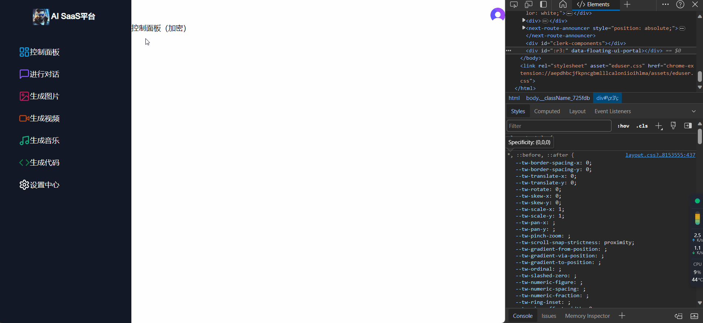

# 04 侧边栏

## 效果展示



## 实现

创建了4个组件

dashboard的`layout`组件中嵌套了`sidebar`和`navbar`组件，`navbar`组件中嵌套`mobile-sidebar`组件（适配手机移动端）

## layout组件

```tsx title="app/(dashboard)/layout.tsx"
import Navbar from "@/components/navbar";
import Sidebar from "@/components/sidebar";

const DashboardLayout = ({ children }: { children: React.ReactNode }) => {
  return (
    <div className="flex relative w-full h-full">
      {/* 这个元素在小屏幕上隐藏，在中等及更大尺寸屏幕上显示为flex布局 */}
      <div className="hidden md:flex md:w-72 h-full bg-gray-900">
        <Sidebar />
      </div>
      <main className="flex-1">
        <Navbar />
        {children}
      </main>
    </div>
  );
};

export default DashboardLayout;
```

创建了一个响应式布局，在小屏幕上隐藏侧边栏，在更大的屏幕上与主内容一起显示，主内容向右移动以为侧边栏腾出空间。

1.**最外层 `div`，`className="flex relative w-full h-full"`**：

-  这个容器被设置为一个 flex 容器（`flex`），它的定位是相对的（`relative`），宽度和高度都是填满父容器（`w-full h-full`）。
- `relative`：这应用了 CSS 属性 `position: relative;`。它允许您相对于此 div 定位子元素（如侧边栏和主内容）。在容器内使用绝对或固定定位时，这是必需的。

2.**侧边栏 `div`，`className="hidden md:flex md:w-72 md:fixed h-full bg-gray-900"`**：

- `hidden`：默认情况下，侧边栏是隐藏的（display: none;）。这可能是为了在较小的屏幕上节省空间，因为侧边栏可能会占用太多空间。

- `md:flex`：在中等尺寸屏幕（`md:` 断点在 Tailwind 中）上，将显示方式更改为 `flex`，使侧边栏可见，并允许其子元素灵活布局。

  - >`hidden`和`md:flex`是用来实现响应式设计。这两个类共同作用，用于控制元素在不同屏幕尺寸下的显示方式。

- `md:w-72`：同样从 `md:` 断点开始，这将侧边栏的宽度设置为固定大小（72 单位，通常是 72 x 4 = 288px）。

- `h-full`：将侧边栏的高度设置为其父元素（最外层的 `div`）的 100%，确保它从顶部延伸到底部。

- `bg-gray-900`：为侧边栏应用深灰色背景颜色（使用 Tailwind 的颜色命名系统）。

3.**主内容区域，`className="flex-1"`**：

- `flex-1`: 这使得主内容区域能够占据剩余空间。在一个 flex 容器中，`flex-1` 表示元素会伸展以填满除其他 flex 元素外的空间。

??? note "md是什么？"

    在使用 Tailwind CSS 这种实用性框架时，`md` 是一个断点（breakpoint）的缩写，代表“medium”（中等）尺寸的屏幕。断点是响应式设计中用于定义不同屏幕尺寸范围的媒体查询标准。每个断点对应于一组屏幕宽度，当屏幕宽度在这个范围内时，相关的样式规则将被应用。
    
    在 Tailwind CSS 中，默认的断点包括：
    
    - `sm`（small）：小屏幕。
    - `md`（medium）：中等屏幕。
    - `lg`（large）：大屏幕。
    - `xl`（extra large）：更大屏幕。
    - `2xl`（2x large）：非常大的屏幕。
    
    例如，如果一个类名前加上 `md:` 前缀（如 `md:flex`），这意味着这个样式仅在屏幕宽度达到 `md` 断点定义的最小宽度时才会生效。这允许开发者根据不同的屏幕尺寸定制布局和样式，从而实现响应式设计。

## sidebar组件

```tsx title="components/sidebar.tsx"
"use client";
import {
  Code,
  ImageIcon,
  LayoutDashboard,
  MessageSquare,
  Music,
  Settings,
  VideoIcon,
} from "lucide-react";
import { usePathname } from "next/navigation";
import Image from "next/image";
import Link from "next/link";

const routes = [
  {
    label: "控制面板",
    icon: LayoutDashboard,
    href: "/dashboard",
    color: "text-sky-500",
  },
  {
    label: "进行对话",
    icon: MessageSquare,
    href: "/conversation",
    color: "text-violet-500",
  },
  {
    label: "生成图片",
    icon: ImageIcon,
    color: "text-pink-700",
    href: "/image",
  },
  {
    label: "生成视频",
    icon: VideoIcon,
    color: "text-orange-700",
    href: "/video",
  },
  {
    label: "生成音乐",
    icon: Music,
    color: "text-emerald-500",
    href: "/music",
  },
  {
    label: "生成代码",
    icon: Code,
    color: "text-green-700",
    href: "/code",
  },
  {
    label: "设置中心",
    icon: Settings,
    href: "/settings",
  },
];

const Sidebar = () => {
  const pathname = usePathname();
  return (
    <div className="w-full h-full relative">
      <div className="flex justify-center items-center w-full text-white pt-7">
        <Link href={"/"} className="flex ">
          <Image src="/logo.jpg" alt="logo" width={36} height={36} />
          <h1 className="p-1 pl-3 font-bold">AI SaaS平台</h1>
        </Link>
      </div>
      <div className="flex-col text-white">
        {routes.map((route) => (
          <Link
            key={route.href}
            href={route.href}
            className={`flex items-center  mx-7 mt-4 p-1 cursor-pointer hover:text-blue-300 hover:bg-white/10 rounded-lg transition hover:scale-110 ${
              pathname === route.href
                ? "text-white bg-white/10"
                : "text-zinc-500"
            }`}
          >
            <div className="flex">
              <route.icon className={`mr-1 ${route.color}`} />
              {route.label}
            </div>
          </Link>
        ))}
      </div>
    </div>
  );
};

export default Sidebar;
```

1.**使用 Next.js 的 `Link` 组件**：

- `Link` 用于创建无需页面重新加载的导航链接，这对于提升用户体验和应用性能非常重要。这在单页应用（SPA）中尤为常见。

2.**引入和使用图标**：

- 通过 `lucide-react` 导入的图标（如 `LayoutDashboard`, `MessageSquare` 等），在侧边栏的每个导航项中作为图标显示。这些图标通过 `icon` 属性动态引用。

3.**动态路由数组 `routes`**：

- `routes` 数组定义了侧边栏的各个导航项。每个对象包含 `label`, `icon`, `href`, 和 `color` 属性，分别表示链接的文本标签、图标组件、导航路径和图标颜色。

4.**迭代渲染导航项**：

- 使用 `map` 函数遍历 `routes` 数组，为每个路由动态创建一个包含图标和标签的链接。这种模式在 React 中用于基于数组数据渲染列表或组件集合。

5.**使用 Tailwind CSS 进行样式设置**：

- 通过类似 `flex`, `justify-center`, `items-center` 等类，使用 Tailwind CSS 实现了侧边栏的布局和样式。Tailwind 提供了一种快速、响应式的方式来定义样式。

6.**顶部 Logo 和标题部分**：

- 使用 `Image` 组件（来自 Next.js）加载和显示 logo。这里的 `Image` 组件用于优化图像加载。
- Logo 和标题被包裹在一个 `Link` 组件中，点击可以导航到应用的首页。

7.**响应式和交互式 UI 设计**：

- 通过类似 `hover:text-blue-300`, `hover:bg-white/10`, `rounded-lg`, `transition`, `hover:scale-110` 等类，实现了鼠标悬浮时的视觉效果，增强了用户交互体验。

??? note "详解hover"

    这些类都来自 Tailwind CSS，是一套实用程序优先的 CSS 框架，用于快速开发和响应式设计。每个类代表一个特定的样式或效果：
    
    1. **`cursor-pointer`**:
    
        - 这个类设置元素的鼠标光标为指针（通常是手形），通常用于指示可点击的元素，类似于链接或按钮。
    
    2. **`hover:text-blue-300`**:
    
        - 这个类表示当鼠标悬停在元素上时，元素的文本颜色变为蓝色。这用于增加交互性，提供视觉反馈。
    
    3. **`hover:bg-white/10`**:
    
        - 这个类在鼠标悬停时改变元素的背景颜色。这里使用的是带透明度的白色（`white/10` 指的是白色，透明度为 10%）。这也是一种常见的交互反馈方式。
    
    4. **`rounded-lg`**:
    
        - 这个类为元素添加较大的圆角边框（`lg` 代表 large）。这是一种常见的 UI 设计方法，使元素看起来更加友好和现代。
    
    5. **`transition`**:
    
        - 这个类应用了 CSS 过渡效果，使得样式的变化（如颜色、背景、尺寸等）更平滑。当结合其他如 `hover:` 类使用时，可以创建更优雅的交互体验。
    
    6. **`hover:scale-110`**:
    
        - 这个类表示当鼠标悬停在元素上时，元素会放大到原始尺寸的 110%。这通过 CSS 的 `transform: scale(1.10)` 实现。这种效果可以吸引用户注意到特定的交互元素。

8.**动态类名**

这段代码使用了多个动态类名

```tsx
import { usePathname } from "next/navigation";

	const pathname = usePathname();
	<div className="flex-col text-white">
        {routes.map((route) => (
          <Link
            key={route.href}
            href={route.href}
            className={`flex items-center  mx-7 mt-4 p-1 cursor-pointer hover:text-blue-300 hover:bg-white/10 rounded-lg transition hover:scale-110 ${
              pathname === route.href
                ? "text-white bg-white/10"
                : "text-zinc-500"
            }`}
          >
            <div className="flex">
              <route.icon className={`mr-1 ${route.color}`} />
              {route.label}
            </div>
          </Link>
```

??? note "静态类名+动态类名 详细解释"

    要结合静态类名和基于条件的动态类名，你可以在同一个 `className` 属性中使用模板字符串。模板字符串允许你在一个字符串中混合使用静态文本和动态表达式。
    
    以下是如何实现它的例子：
    
    ```jsx
    <div className="flex">
      <route.icon className={`static-class-name ${pathname === route.href ? 'text-white bg-white/10' : 'text-zinc-400'}`} />
      {route.label}
    </div>
    ```
    
    在这个例子中：
    
    - `static-class-name` 是始终会被应用的静态类名。
    - `pathname === route.href ? 'text-white bg-white/10' : 'text-zinc-400'` 是基于条件的动态表达式。如果条件为真（`pathname` 与 `route.href` 相等），则使用 `'text-white bg-white/10'` 作为类名；如果条件为假，则使用 `'text-zinc-400'`。
    
    通过这种方式，你可以灵活地结合使用静态和动态类名，以适应不同的样式需求。


## navbar组件

```tsx title="components/navbar.tsx"
import { UserButton } from "@clerk/nextjs";
import MobileSidebar from "./mobile-sidebar";

const Navbar = () => {
  return (
    <div>
      <MobileSidebar />
      <div className="flex justify-end mr-6 mt-6">
        <UserButton afterSignOutUrl="/" />
      </div>
    </div>
  );
};

export default Navbar;
```

把clerk库的`UserButton`组件放在最右端

## mobile-sidebar组件

```tsx title="components/mobile-sidebar.tsx"
import { Menu } from "lucide-react";

import { Sheet, SheetContent, SheetTrigger } from "@/components/ui/sheet";
import Sidebar from "./sidebar";

const MobileSidebar = () => {
  return (
    <Sheet>
      <SheetTrigger className="md:hidden">
        <Menu />
      </SheetTrigger>
      <SheetContent side="left" className="bg-gray-900">
        <Sidebar />
      </SheetContent>
    </Sheet>
  );
};

export default MobileSidebar;
```

使用了shadcn/ui的sheet组件，需要先安装

`npx shadcn-ui@latest add sheet`

详情请看[Sheet - shadcn/ui](https://ui.shadcn.com/docs/components/sheet)
